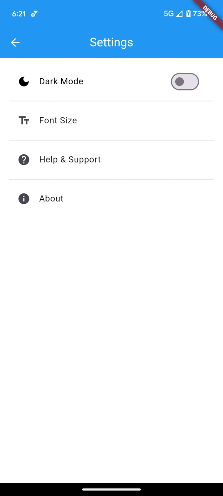
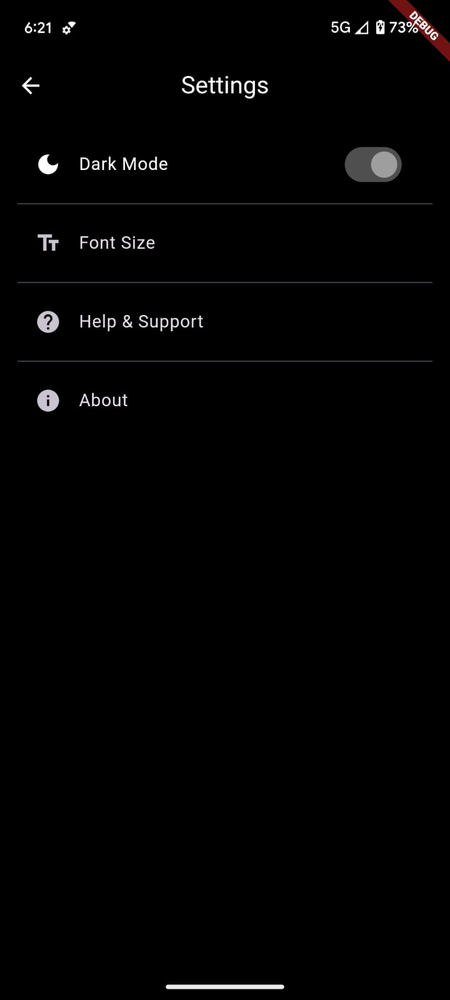
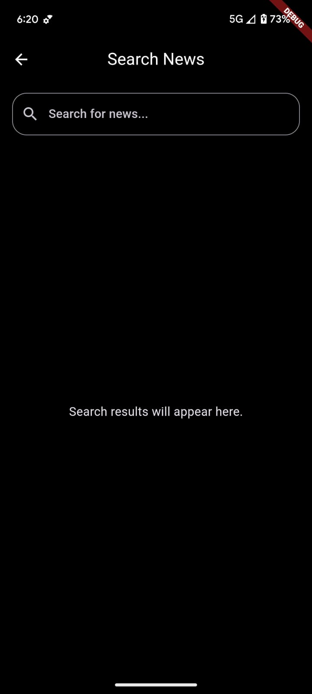

# news_app

A Flutter project. 

The News App is a feature-rich mobile application that delivers the latest news from various categories such as technology, business, sports, entertainment, and more. Built using Flutter, it offers a seamless user experience with theme switching between dark and light modes for personalized viewing.

# Features :  
Dynamic News Updates: Fetches real-time news from a reliable API. 
Category Filtering: Browse news based on categories like Technology, Business, Sports, etc. 
Theme Switching: Toggle between light and dark themes for comfortable reading. 
Search Functionality: Easily find specific news articles using keywords. 
Responsive Design: Optimized for various screen sizes. 

# <bold>Tech Stack<bold> :  
Frontend: Flutter (Dart) 
Backend API: News API (REST API integration) 
UI/UX: Clean and responsive design for optimal user experience. 

<video width="320" height="240" controls>
  <source src="C:\Users\Vidhika's ASUS\Desktop\news_app.mp4" type="video/mp4">
</video>
